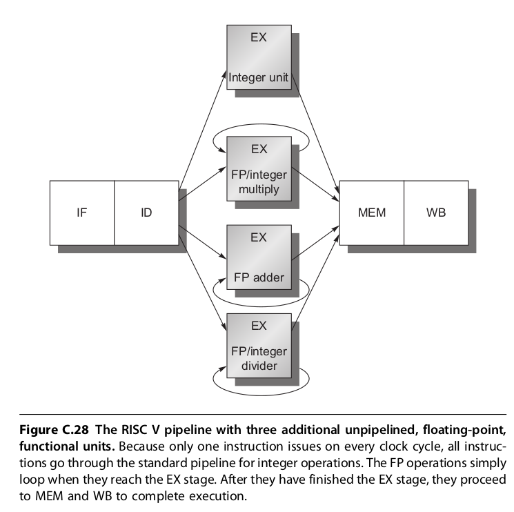

# ECE 668 Simulator definition
[toc]

## Expectations

The goal of version 1.0 is to meet the minimum course requirement. Remember, the goal of this project is to show our understanding of score-boarding. We should only implement necessary functions and all related functions as simple as possible.

## Hardware

The number of function units is configurable



>  ST: I adjusted Hanmei's implementation to make it consistent with the book and course. (Book Page C-47, Slide Lesson 09, P18 ) 


| Function Unit    | Description| Configurable Parameter |Latency|
| -------- |-------- |-------- |-------- |
| Int Adder    | suitable for any kinds of operations on integers. eg: Integer Add/SUB ,Branch. Load and Stores |Number,Latency (in Cycles)|1|
| FP Adder   | Float Point Adder      |Number,Latency (in Cycles)|2|
| FP/Integer Multiplier | Float Point or Integer Multiplier |Number,Latency (in Cycles)|10|
| FP/Integer Divider | Float Point or Integer Divider  |Number,Latency (in Cycles)|40|

## Assembler Directives

Assembler should perform these operations before program execution.


| Directives |  Description|
| ----------- | ------ |
| .data       | start of data segment   |
| NAME: .word  10| word 32 bits word |
| NAME: .double 10.5| word 64 bits floating-point |
| .code         | start of code segment |
| tag:         | mark source code location. Can be used as a immediate number |

## Instruction Sets

> [Reference](https://en.wikibooks.org/wiki/MIPS_Assembly/Instruction_Formats)

Instruction Formats:
- R-Format:  all the data values used by the instruction are located in registers. (Op code range: 0x10-0x1F)
  
  - OP rt, rs, rd
- I-Format:  The instruction must operate on an immediate value and a register value.  (Op code range: 0x20-0x2F)
  - OP rt, IMM(rs)
  - OP  rt, rs, IMM
- FR-Format: Similar to R-Format, but all registers are floatpoint rather than int (Op code range: 0x30-0x3F)
  
  - OP ft, fs, fd
- FI-Format: Similar to I-Format, but all registers are floatpoint rather than int (Op code range: 0x40-0x4F)
  
  - OP ft, fs, IMM
- J-Format: Jump instruction  (Op code range: 0x50-0x5F)
  
  - Opcode Pseudo-Address 
- Single-OP-Format: Only one OP, no parameters   (Op code range: 0x60-0x6F)
  
  - OP
  


| Instruction | Example | Description|Format|FU|OpCode|
| ----------- | ---- | ------ | ------ |------ |------ |
| LW reg,imm(reg) |LW R2,0(R4)|load 32-bit word|I-Format|INT|0x20|
| SW reg,imm(reg)|SW R5 8(R4)|store 32-bit word|I-Format|INT|0x21|
| ||||||
| L.D freg,imm(reg) |L.D F4,10(R2)|load 64-bit floating-point|FI-Format|FP Adder|0x40|
| S.D freg,imm(reg)|S.D F6,0(R5)|store 64-bit floating-point|FI-Format|FP Adder|0x41|
| ||||||
| ADD.D freg,freg,freg| ADD.D F2,F2,F1  |add floating-point|FR-Format|FP Adder|0x30|
| SUB.D freg,freg,freg | SUB.D F6,F5,F4 |subtract floating-point|FR-Format|FP Adder|0x31|
| MUL.D freg,freg,freg| MUL.D F3,F4,F2 |multiply floating-point|FR-Format|FP/Integer Multiplier|0x32|
| DIV.D freg,freg,freg| DIV.D F1,F1,F1  |divide floating-point|FR-Format|FP/Integer Divider|0x33|
| ||||||
| DADD reg,reg,reg| DADD R5,R2,R3 | add integers|R-Format|Integer|0x10|
| DADDI reg,reg,imm| DADDI R2,R2,1 | add immediate|I-Format|Integer|0x22|
| DSUB reg,reg,reg| DSUB R5,R2,R3 | subtract integers|R-Format|Integer|0x11|
| DSUBI reg,reg,imm| DSUBI R3,R6,7 | subtract immediate|I-Format|Integer|0x23|
| DMUL freg,freg,freg| DMUL R3,R4,R2 |multiply intergers|R-Format|FP/Integer Multiplier|0x12|
| DDIV freg,freg,freg| DDIV R1,R1,R1  |divide integers|R-Format|FP/Integer Divider|0x13|
| ||||||
| BEQ reg,reg,imm| BEQ R1,R2,-48  |branch if pair of registers are not equal|I-Format|Integer|0x24|
| BNE reg,reg,imm| BNE R2,R4,4  |branch if pair of registers are not equal|I-Format|Integer|0x25|
| BNEZ reg,imm| BNE R1,loop  |branch if reg is zero|I-Format|Integer|0x26|
| ||||||
| J imm | J 1231 | jump to immediate address         |j-Format|Integer|0x50|
| ||||||
| NOP | NOP | No operation    | SINGLE_OP_FORMAT ||0x60|
| HALT | HALT | stops the program    |SINGLE_OP_FORMAT||0x61|

### An example
```
.data
A: .word 10
B: .word 8
C: .double 3.14

.code
loop: 
    L.D F0, 0(R1)
    MUL.D F4,F0,F2
    S.D F4,0(R1)
    DSUBI R1,R1,8
    BENZ R1,loop
halt
```

## Exception Handling

Don't handle exception, execute as is

## Interrupts

Not supported


## I/O Format

Read/Write input from a .s file

Scoreboarding Instruction Status Table (In Window)

Scoreboarding Register Status Table (In Window)

Scoreboarding Register Status Table (In Window)

Memory Dump (In Window)

Final Registers Dump (In Window)

