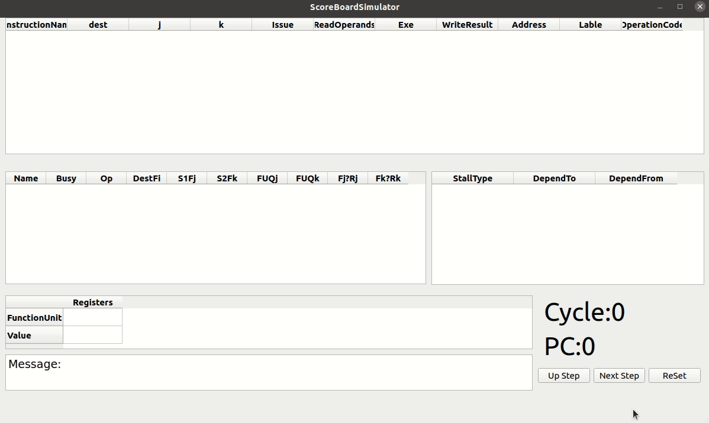

# Scoreboard Simulator

This is our ECE668@UMASS course project.

We implemented a simulator with scoreboard support.

Written in pure python, GUI built using QT.

### Feature

| Task                                      |Comments |
| ----------------------------------------- |  -------- |
| Scoreboard dynamic scheduling             |           |
| Make simulator support actual calculation |See [Definition File](DefineTheSimulator/Define_The_Simulator.md) for supported instructions   |
| Detect hazard info in detail              |           |
| Time-travel debugging feature             | Support backward execution |
| Compact, Intuitive GUI                    |           |
| Test cases                    |   Please see .in files under scoreboard folder   |
### Look and Feel

